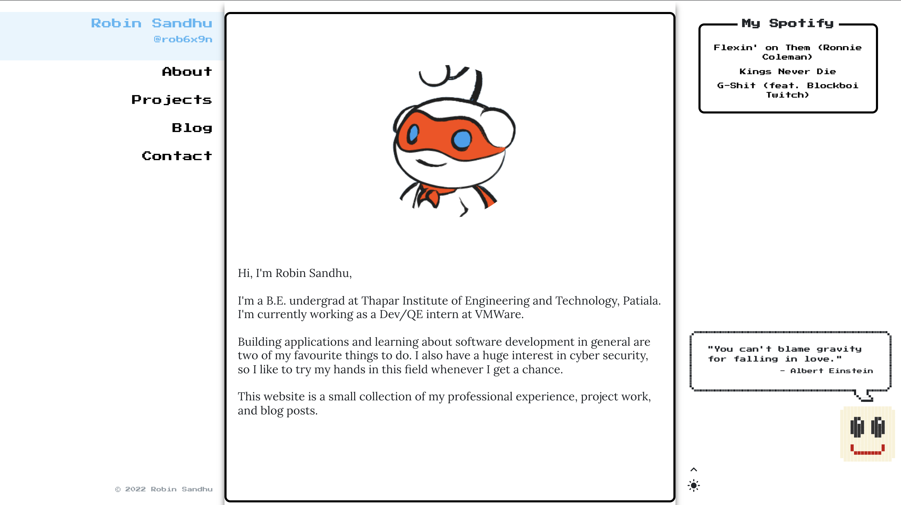

# Portfolio Website - Frontend

A Single Page Portfolio Website frontend coded in ReactJS

## Features:
Fully reactive design that means it also works on mobile devices.

Supports Dark Mode.

It supports medium blog post embeds which requires using a custom proxy for bypassing the CORS. 
(For my current hosted version I am using a proxy hosted on heroku. You can check its url in the code itself.)
